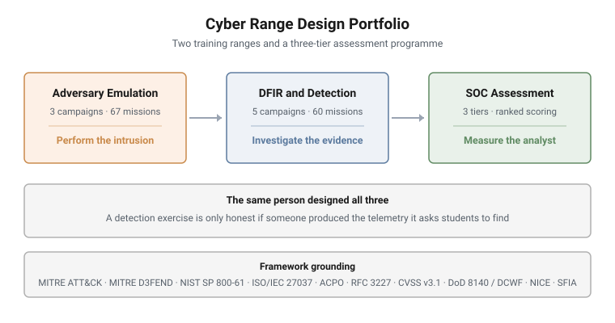

# Cyber Range Design

Design documentation for hands-on cyber security ranges I designed and built:
two training ranges, one offensive and one defensive, and a three-tier SOC
analyst assessment programme.

**8 training campaigns, 127 graded missions, and a 3-tier assessment
programme.** Built on a commercial cyber range platform for a national cyber
security training programme.

**Answer keys and walkthroughs are deliberately not published.** These courses
are delivered commercially and the assessments are live. What is here is the
design: scenarios, chains, block structure, learning objectives, environment
topology, and the reasoning behind them.

---

<picture>
  <source media="(prefers-color-scheme: dark)" srcset="diagrams/portfolio-overview-dark.svg">
  
</picture>

## The two ranges

### [Adversary emulation](ranges/adversary-emulation/) - 3 campaigns, 67 missions

An authorised adversary-emulation progression against an isolated lab Active
Directory domain. Each day operates from the position the previous day reached.

| Campaign | Focus | Missions |
|---|---|---|
| [AD Enumeration & Path Discovery](ranges/adversary-emulation/01-ad-enumeration.md) | Profile a host and a domain, map the routes an adversary could travel | 19 |
| [Movement, Privilege Escalation, Persistence](ranges/adversary-emulation/02-movement-privesc-persistence.md) | Reuse token context, move laterally, escalate, establish persistence | 26 |
| [Stealth, Payload Handling, C2](ranges/adversary-emulation/03-stealth-payload-c2.md) | Operate against logging and in-memory defences, integrate with a C2 framework | 22 |

### [DFIR and detection](ranges/dfir/) - 5 campaigns, 60 missions

The other side of the same coin: finding and reconstructing an intrusion from
the evidence it leaves behind. One continuity scenario across the week.

| Campaign | Focus | Missions |
|---|---|---|
| [Foundations & Evidence Orientation](ranges/dfir/01-foundations-evidence-orientation.md) | Evidence handling, chain of custody, orientation on the estate | 13 |
| [First-Response Triage](ranges/dfir/02-first-response-triage.md) | Work a live incident under first-response constraints | 11 |
| [Detection & Log Analysis](ranges/dfir/03-detection-log-analysis.md) | Validate alerts, separate true from false positives, scope indicators | 12 |
| [Triage & Severity Scoring](ranges/dfir/04-triage-severity-scoring.md) | Score three incidents with CVSS v3.1 and prioritise the queue | 12 |
| [Live Volatile Collection](ranges/dfir/05-live-volatile-collection.md) | Collect volatile evidence in order of volatility from a running host | 12 |

---

### [SOC analyst assessment programme](ranges/soc-assessments/) - 3 tiers

A separate product from the training ranges: an instrument that **measures**
whether an analyst can find an intrusion, rather than one that teaches them to.

| Tier | Assessment | Work role | Sector |
|---|---|---|---|
| I | [SIEM Intrusion Triage](ranges/soc-assessments/01-soc-i-siem-intrusion-triage.md) | DCWF 511 Cyber Defense Analyst | Financial services |
| II | [Intrusion Containment](ranges/soc-assessments/02-soc-ii-intrusion-containment.md) | DCWF 531 Cyber Defense Incident Responder | Electricity distribution |
| III | [Hunt & Attribution](ranges/soc-assessments/03-soc-iii-hunt-attribution.md) | DCWF 141 Threat/Warning Analyst | Telecommunications |

Three two-hour, numerically scored assessments across three critical
infrastructure sectors. What the candidate is handed at minute zero is the
design: a detection, a foothold, or one external indicator and no incident.

Tiered against **DoD 8140 / DCWF** rather than an invented scale, with NICE
supplying the assessable task and skill statements. Architecture and framework
grounding are documented; mission content is not, for the reasons given on that
page.

---

## Why both

The same person designed the range that emulates the intrusion and the range
that investigates it. That is deliberate.

A detection exercise is only honest if someone actually produced the telemetry
it asks students to find. An emulation exercise is only useful if you know what
the defender will see. Building both sides means the offensive range is written
with the evidence trail in mind, and the defensive range is built on artifacts
that a real technique actually leaves behind.

It also shows up inside the offensive campaigns, where every technique is
paired with the question of how it appears in the defender's telemetry. A
student who can run a domain enumeration but cannot tell a blue team which log
sources would have caught it has learned half the lesson.

---

## Framework grounding

Every range is written against published standards rather than an in-house
scheme, so the competencies assessed mean something outside the organisation
that issued them.

| Framework | Where it is used |
|---|---|
| **MITRE ATT&CK** Enterprise | Adversary emulation: technique-level mapping on every campaign |
| **MITRE D3FEND** (v1.3.0) | The defensive counterpart, across DFIR and the assessment programme |
| **NIST SP 800-61** | DFIR: the incident response life cycle and its phase boundaries |
| **ISO/IEC 27037** | DFIR: identification, collection, acquisition and preservation of evidence |
| **ACPO** Good Practice Guide | DFIR: the handling principles applied to live decisions |
| **RFC 3227** | DFIR: order of volatility governing live collection |
| **CVSS v3.1** | DFIR: base metrics, scoring, and vector construction |
| **DoD 8140 / DCWF** (DoDM 8140.03) | SOC programme: the primary tiering standard, work roles 511 / 531 / 141 |
| **NICE** (NIST SP 800-181r1) | SOC programme: assessable Task, Knowledge and Skill statements |
| **SFIA** | SOC programme: responsibility and autonomy levels |

Each campaign page carries its own alignment table. The ATT&CK mapping is a
technique-level correspondence describing what a student actually performs, not
a formal control mapping.

---

## Teaching students to distrust AI-generated code

The adversary emulation range assesses something most offensive training does
not: **whether a student can critically review code a language model wrote for
them.**

Students are given AI-generated PowerShell and asked to find what is wrong with
it - a cmdlet that does not exist, a scope boundary the script quietly crosses -
and then to harden and run a corrected version. It appears in all three
campaigns and has a dedicated module in the third.

This was added because it is now how offensive scripts actually get written.
A student who runs generated code without reading it will eventually run
something that touches a host outside the engagement scope, and the time to
learn that is in a lab.

---

## Design constraints

These campaigns are graded and auto-scored, which makes assessment integrity a
design problem rather than an afterthought. Four constraints shaped every one:

- **Answers are anchored to the environment.** A graded answer must be
  derivable only by doing the work in the range. A mission whose answer can be
  produced without touching the environment measures nothing.
- **Difficulty is measured, not asserted.** What a mission was priced at, what
  a change was expected to do, and what a solver actually experienced are three
  different numbers and are kept apart.
- **Answer integrity is designed in, not patched on.** An answer that is
  readable on the host, or reachable without the taught skill, is not an
  assessment question.
- **Nothing ships unvalidated.** Mechanical checks before release, and a blind
  solve by someone who did not build it.

---

## What is not in this repository

- Answer keys, accepted values, and walkthroughs
- The full mission list. Block structure and counts are published; the 127
  individual task statements are not, because they are live questions
- All assessment content. For the SOC programme only the architecture and its
  framework grounding are documented: no mission structure, scenario, estate or
  difficulty arithmetic
- Platform workbooks, build scripts, and telemetry generators
- Credentials, machine images, and internal addressing
- Course slide decks, student handouts and written assessments

This documentation was authored from design sources rather than exported from
delivery material, so nothing withheld is recoverable from what is here.

---

## Licence

Documentation licensed [CC BY 4.0](LICENSE). Published with the permission of
the client for whom the courses were developed.

---

> **Confidentiality.** These cyber ranges were designed and built for private
> clients. This page documents design and architecture only. Scenario content,
> mission structure, answer keys and walkthroughs remain confidential, and are
> neither published here nor available on request.
