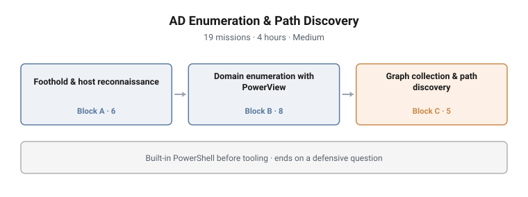

# AD Enumeration & Path Discovery

**Range:** Adversary emulation · **Day:** 1 of 3 · **Duration:** 4 hours
**Difficulty:** Medium · **Missions:** 19 · **Stream:** Red / active defense

<picture>
  <source media="(prefers-color-scheme: dark)" srcset="../../diagrams/ae-01-ad-enumeration-dark.svg">
  
</picture>

## Scenario

The student holds an authorised low-privilege foothold on a member workstation
inside an isolated lab Active Directory domain. No administrative rights, no
prior knowledge of the estate, and no map.

The task is the one that opens every real engagement: work out where you are,
what the domain looks like from here, and which routes exist between this
foothold and anything that matters.

## Objectives

By the end of the campaign the student can:

- Explain PowerShell's execution model and its role in authorised enumeration
- Profile a Windows host from a standard-user context: identity, privileges,
  installed software, running services and the identities they run as
- Enumerate an Active Directory domain: users, groups, computers, trusts,
  service principal names and ACL relationships
- Collect graph data and interpret privilege relationships as routes
- Judge which of several available routes is worth taking, and which single
  relationship a defender should remove
- Review AI-generated PowerShell critically before executing it
- Describe what each activity above looks like in defender telemetry

## Technical scope

**Environment**

| Role | Purpose |
|---|---|
| Domain controller | The directory the student enumerates |
| Member workstation | The student's foothold, entered as a standard domain user |
| Servers | Supply the privilege relationships that make path discovery non-trivial |
| Operator host | The tooling workstation the student launches from |

**What the student works with**

Local host state (security context and token groups, service configuration and
run-as identities, local administrators, OS build), directory objects (user,
group and computer populations, domain and controller identity, service
principal names, discretionary ACLs), and the relationship graph derived from
them (session, local-admin and object-control edges).

**Operations required**

- Interrogate the local security context and read a token's group membership
- Profile a host through CIM/WMI and service configuration rather than by
  reading files
- Query directory objects at scale and filter them to the ones that carry
  privilege
- Identify accounts whose configuration exposes them, including service
  identities registered with SPNs
- Read discretionary ACLs and recognise which rights confer effective control
- Run a graph collector and interpret the resulting relationship data
- Reason from the graph to a route, and from a route to a defensive control

**Tooling**

Built-in PowerShell and CIM/WMI, PowerView, SharpHound, BloodHound.

**Assumed knowledge**

Day-1 theory: PowerShell language fundamentals, the pipeline and object model,
execution policy and script blocks. Basic familiarity with Active Directory
concepts.

## Structure and progression

| Block | Focus | Missions |
|---|---|---|
| A | Foothold and host reconnaissance | 6 |
| B | Domain enumeration with PowerView | 8 |
| C | Graph collection and lateral-movement path discovery | 5 |

The campaign moves outward in widening circles, and the ordering is the
teaching content.

**Block A stays on the machine the student is standing on.** Operating context,
host identity, the services running and the identities behind them, and who
administers the box. It closes by profiling a second host, which is the first
time the student looks outward.

**Block B moves into the directory.** Sizing the populations, locating the
controller, and finding the accounts and rights that matter. This is where a
flat list of objects starts to acquire structure.

**Block C converts structure into a graph and reads it.** Collection, then
analysis, then the identification of routes. The block ends on a defensive
question rather than an offensive one: given this graph, which single edge
would you cut?

Blocks A and B use built-in PowerShell before any third-party tooling is
introduced. The final mission of the campaign hands the student AI-generated
PowerShell and asks what is wrong with it.

## What makes this hard

**The graph is the difficulty, not the collection.** Running a collector is
mechanical. Reading the resulting relationships and judging which route is worth
taking is analytical, and it is where the campaign separates students who
understand privilege relationships from students who can operate a tool.

**A path that exists is not a path worth taking.** Several routes are present.
Choosing well requires reasoning about noise, privilege and reversibility, not
just about reachability.

**The defensive cut inverts the whole exercise.** After three blocks of
offensive work, the student is asked which relationship to remove. Answering
requires understanding the graph well enough to reason about it from the other
side, and it is the mission that most reliably distinguishes comprehension from
operation.

## Design notes

**Answers are environment-derived.** Every graded value has to be produced by
querying the range. A mission answerable from prior knowledge measures what the
student arrived with rather than what the range taught.

**Built-ins before tooling, and it costs something.** Two blocks could have been
completed faster with PowerView throughout. The slower path is deliberate: a
student who reaches for a tool before understanding what the operating system
already exposes learns the tool, and is helpless the moment it is blocked or
unavailable.

**Difficulty comes from analysis, not obscurity.** Nothing is hidden to create
difficulty. Difficulty manufactured by hiding things is fragile, because it
disappears the moment one student tells another where to look.

**Wrong routes are rejectable from evidence.** Where the campaign presents a
plausible but inferior path, the student can rule it out from the data rather
than by guessing what the author intended. A decoy that can only be rejected by
second-guessing the designer is a defect, not difficulty.

## Why this matters operationally

**Directory enumeration is the universal first move.** Every intrusion that
reaches an Active Directory environment answers the same questions the student
answers here: who am I, what can I reach, and what is worth reaching. The
relationships a graph collector surfaces are the same ones that turn a foothold
into domain compromise.

**The tradecraft is native machinery.** Directory queries are what domain-joined
machines do continuously. That is what makes enumeration attractive to an
adversary and hard for a defender: the traffic is indistinguishable from normal
operation without volume and sequence analysis.

**Service accounts with SPNs are a standing exposure.** They exist in nearly
every estate, they are frequently over-privileged, and they are the reason
Kerberos-based credential attacks remain effective. Finding them is
reconnaissance; understanding why they matter is the lesson.

**Graph thinking is now the defender's job too.** Blue teams increasingly run
the same collectors to find and remove the paths before an adversary uses them.
A student who can read the graph offensively can read it defensively, which is
exactly what the closing mission tests.

## Framework alignment

Techniques exercised, mapped to MITRE ATT&CK Enterprise. This is a
technique-level correspondence describing what a student actually performs, not
a formal control mapping.

| Tactic | Technique |
|---|---|
| Discovery | T1033 System Owner/User Discovery |
| Discovery | T1082 System Information Discovery |
| Discovery | T1007 System Service Discovery |
| Discovery | T1087.002 Account Discovery: Domain Account |
| Discovery | T1069.002 Permission Groups Discovery: Domain Groups |
| Discovery | T1018 Remote System Discovery |
| Discovery | T1482 Domain Trust Discovery |
| Execution | T1059.001 Command and Scripting Interpreter: PowerShell |

**MITRE D3FEND** supplies the defensive counterpart throughout: each technique is
paired with the observation surface it exposes, which is what makes the closing
defensive mission answerable.

---

> **Confidentiality.** These cyber ranges were designed and built for private
> clients. This page documents design and architecture only. Scenario content,
> mission structure, answer keys and walkthroughs remain confidential, and are
> neither published here nor available on request.
