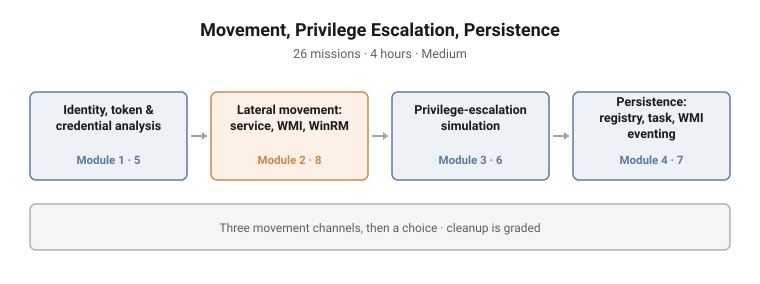

# Movement, Privilege Escalation, Persistence

**Range:** Adversary emulation · **Day:** 2 of 3 · **Duration:** 4 hours
**Difficulty:** Medium · **Missions:** 26 · **Stream:** Red / active defense

<picture>
  <source media="(prefers-color-scheme: dark)" srcset="../../diagrams/ae-02-movement-privesc-persistence-dark.svg">
  
</picture>

## Scenario

The student begins from the position Day 1 established: a mapped domain, a known
set of routes, and a low-privilege foothold. The question is no longer where to
go but how to get there, what to do on arrival, and how to still be there
tomorrow.

## Objectives

- Analyse identity, token and cached credential material on a compromised host
- Recover credential material and reuse it without re-authenticating in the
  noisiest way available
- Move laterally by service execution, WMI and WinRM, and choose between them on
  operational grounds
- Identify, profile and validate a privilege-escalation path arising from a
  service misconfiguration
- Establish persistence by three distinct mechanisms and describe the telemetry
  signature each produces
- Verify that a host has been returned to a clean state
- Review AI-generated persistence code critically before executing it

## Technical scope

**Environment**

The Day-1 domain, entered from the same foothold. A second workstation and at
least one server are reachable, and the estate carries a deliberate,
documented service misconfiguration that the escalation module targets.

**What the student works with**

Access tokens and their privilege sets, cached Kerberos material, service
account context on the host, remote execution channels, and the three
persistence surfaces Windows exposes: the registry, the task scheduler, and WMI
event subscription.

**Operations required**

- Distinguish a primary token from an impersonation token, and enumerate the
  privileges each carries
- Inspect cached Kerberos material and reason about what it permits
- Recover credential material available in the host's context
- Execute remotely over three distinct channels and compare their behaviour
- Run automated privilege-escalation checks, then validate a finding manually
  rather than trusting the tool's verdict
- Profile a misconfigured service to the point of proving the escalation is real
- Implant persistence three ways, including the three-component WMI eventing
  construct
- Enumerate and remove persistence, then prove removal

**Tooling**

Built-in PowerShell, PowerUp, WinRM and WMI remoting, service control tooling.

**Assumed knowledge**

Day 1 completed: host and domain enumeration, path discovery, and the ability to
read a privilege relationship.

## Structure and progression

| Module | Focus | Missions |
|---|---|---|
| 1 | Identity, token and credential analysis | 5 |
| 2 | Lateral movement: service, WMI, WinRM | 8 |
| 3 | Privilege-escalation simulation with PowerUp | 6 |
| 4 | Persistence: registry, scheduled task, WMI eventing | 7 |

**Module 1 establishes what the student actually holds.** Movement without
knowing your own token, privileges and cached material is guesswork.

**Module 2 is the core of the day.** The student recovers a movement credential,
then moves by more than one channel and compares them. It deliberately includes
a mission on which channel is quietest, and one on validating tooling before
use.

**Module 3 escalates.** Automated checks, then the writable path, then profiling
the abusable service, then validated escalation. It closes on validating before
acting, which is the module's actual lesson.

**Module 4 persists, then cleans up.** Three mechanisms, then proof the host is
clean. The final mission reviews AI-generated persistence code.

The ordering follows dependency: movement needs credential material, escalation
is more useful once more than one host is reachable, and persistence is what you
do once you have something worth keeping.

## What makes this hard

**Choosing a channel, not just using one.** Executing over WinRM is mechanical.
Deciding that WinRM is the wrong choice here, and being able to say why in terms
of what each channel emits, is the assessed skill.

**Validation before action.** PowerUp reports candidate escalations. Some are not
real. A student who acts on the tool's output without confirming the
precondition learns to trust a scanner, which is the opposite of the intended
lesson.

**The WMI eventing triad.** Persistence via WMI event subscription requires three
components that only function together. It is the most conceptually demanding
mechanism in the campaign and the least familiar to most students.

**Proving a host is clean.** Removal is easy to claim and hard to demonstrate.
The mission requires enumeration rather than assertion, and it is the one
students most often get wrong on the first attempt.

## Design notes

**Three channels, not one.** Teaching a single lateral movement technique
produces students who use it everywhere. Teaching three and then asking which is
quietest produces students who choose. The comparison mission is worth more than
any of the three execution missions individually.

**Escalation is simulated, and labelled as such.** The environment carries a
deliberate, documented misconfiguration. The student practises identification
and validation rather than exploit development, which is the skill the module is
actually for.

**Cleanup is graded, because it is the step students skip.** Including it as a
scored mission makes it part of the technique rather than an optional courtesy.
On a real engagement, persistence you cannot remove is a liability you leave with
the client.

**Persistence is paired with its telemetry.** Each mechanism is taught alongside
what it writes to defender-visible logs, so the student leaves able to argue both
sides.

## Why this matters operationally

**Living-off-the-land is the norm.** WMI, WinRM, scheduled tasks and registry
autoruns are native administrative machinery. That is exactly what makes them
attractive to an adversary and hard for a defender: the same event that indicates
compromise also indicates a Tuesday afternoon.

**Persistence is where an intrusion becomes an incident.** An intrusion that is
evicted is an alert. One that survives eviction is a breach. Three mechanisms are
taught because defenders who check only the obvious one develop a blind spot that
adversaries rely on.

**Credential reuse beats credential cracking.** Most lateral movement in real
intrusions uses material already present on the host. The module reflects that
by starting with what the token and cache already hold.

**Service misconfiguration is a durable, unglamorous reality.** Weak service
permissions and writable paths persist in estates for years because nothing
alerts on them. Finding one is routine work that remains effective.

## Framework alignment

| Tactic | Technique |
|---|---|
| Credential Access | T1003 OS Credential Dumping |
| Credential Access | T1558 Steal or Forge Kerberos Tickets |
| Privilege Escalation | T1134 Access Token Manipulation |
| Privilege Escalation | T1574 Hijack Execution Flow |
| Lateral Movement | T1021.006 Remote Services: Windows Remote Management |
| Lateral Movement | T1047 Windows Management Instrumentation |
| Lateral Movement | T1550 Use Alternate Authentication Material |
| Persistence | T1547.001 Boot or Logon Autostart: Registry Run Keys |
| Persistence | T1053.005 Scheduled Task/Job: Scheduled Task |
| Persistence | T1546.003 Event Triggered Execution: WMI Event Subscription |
| Persistence | T1543.003 Create or Modify System Process: Windows Service |

**MITRE D3FEND** covers the removal side: each persistence mechanism is paired
with the enumeration technique that finds it, which is what the cleanup mission
assesses.

---

> **Confidentiality.** These cyber ranges were designed and built for private
> clients. This page documents design and architecture only. Scenario content,
> mission structure, answer keys and walkthroughs remain confidential, and are
> neither published here nor available on request.
