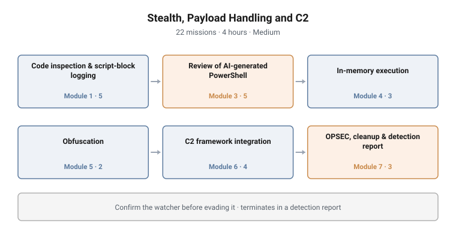

# Stealth, Payload Handling and C2

**Range:** Adversary emulation · **Day:** 3 of 3 · **Duration:** 4 hours
**Difficulty:** Medium · **Missions:** 22 · **Stream:** Red / active defense

<picture>
  <source media="(prefers-color-scheme: dark)" srcset="../../diagrams/ae-03-stealth-payload-c2-dark.svg">
  
</picture>

## Scenario

The student has access and has kept it. Now the environment is watching. Script
block logging is on, in-memory inspection is active, and the question for the
day is whether the student can operate against a defender who is paying
attention, and then report honestly on what that defender could have caught.

## Objectives

- Confirm what host-based code inspection is active, and establish what it
  actually observes
- Read and interpret the defender's own logs, including decoding an encoded
  command
- Identify defects in AI-generated PowerShell, including a non-existent cmdlet
  and an out-of-scope target, and harden it before use
- Execute tooling in memory and fingerprint what that leaves behind
- Apply obfuscation and recognise the tells it introduces
- Integrate with a C2 framework end to end: listener, stager, callback, tasking
- Reverse a persistence artefact, clean up, and identify what cleanup itself
  leaves
- Produce a detection-opportunities report a blue team can act on

## Technical scope

**Environment**

The Day-2 estate with host-based code inspection and script-block logging
enabled and verifiable. An operator host runs the C2 infrastructure; the C2
endpoints are internal range addresses with no route outside the lab.

**What the student works with**

Host logging configuration and the logs themselves, encoded command payloads,
AI-generated scripts containing deliberate defects, in-memory execution
primitives, an obfuscation toolkit, two C2 frameworks, and the artefacts a
previous day's persistence left behind.

**Operations required**

- Establish the live state of code inspection and logging rather than assuming a
  default configuration
- Read defender telemetry and decode an encoded command from it
- Verify whether a cmdlet exists, and enforce a scope boundary in a script
- Load and execute tooling in memory, then characterise its footprint
- Obfuscate a benign loader, run it, and then identify the signature obfuscation
  introduces
- Stand up a listener, generate a stager, obtain a callback and task an agent on
  one framework; build an agent, obtain a callback and task it on a second
- Locate, read and reverse a persistence artefact
- Enumerate what a cleanup operation itself writes

**Tooling**

Built-in PowerShell, in-memory loaders, an obfuscation toolkit, and two C2
frameworks hands-on. A third commercial framework is covered awareness-only,
with the tooling boundary itself assessed as a mission.

**Assumed knowledge**

Days 1 and 2 completed: enumeration, movement, escalation and persistence, and
familiarity with what each writes to defender-visible logs.

## Structure and progression

| Module | Focus | Missions |
|---|---|---|
| 1 | Code inspection and script-block logging | 5 |
| 3 | Critical review and hardening of AI-generated PowerShell | 5 |
| 4 | In-memory execution | 3 |
| 5 | Obfuscation | 2 |
| 6 | C2 framework integration | 4 |
| 7 | OPSEC, artefact cleanup and the detection report | 3 |

The day alternates offensive and defensive perspectives by design. Every
offensive module is accompanied by the question of what it looked like from the
other side, and the campaign terminates in a written report rather than in a
successful callback.

**Module 1 confirms the watcher before anything tries to evade it.** Module 3
treats generated code as untrusted input. Module 4 executes in memory and then
fingerprints the result. Module 5 teaches obfuscation and its tells together.
Module 6 covers two frameworks end to end and closes on engagement scope.
Module 7 reverses an artefact, establishes that cleanup leaves traces, and
produces the deliverable.

## What makes this hard

**Operating against observed reality, not assumed defaults.** The student cannot
rely on a remembered configuration. Everything after Module 1 is measured
against what the logging actually does in this environment.

**Finding a defect in code that looks correct.** The AI-generated script is
plausible. A hallucinated cmdlet and a quiet scope violation are both easy to
read past, which is exactly why the module exists.

**Obfuscation is detectable as obfuscation.** Students expect obfuscation to
reduce detectability. The module makes them find the signature it introduces,
which is a more useful and less comfortable lesson.

**Cleanup leaves traces.** This is the finding most likely to surprise a
student, and it is the honest conclusion of the day: there is no operation that
leaves nothing, only operations whose traces nobody looked for.

## Design notes

**Confirm the watcher before evading it.** Module 1 could have opened with an
evasion technique. Opening instead with "prove what is logging" means every
technique afterwards is measured against observation rather than assumption.

**The tooling boundary is a graded mission.** Naming the out-of-scope target and
enforcing scope are assessed items, not briefing notes. On an engagement, scope
is the difference between a test and an incident.

**Two frameworks hands-on, one awareness-only.** Teaching a single C2 framework
produces familiarity with a product. Teaching two produces an understanding of
the pattern common to all of them: listener, stager, callback, tasking.

**The deliverable is a report, not access.** The campaign's terminal mission is
a detection-opportunities report. That ordering is what makes this an active
defense course rather than an offensive one: the output is a defender who knows
what to look for.

## Why this matters operationally

**The defender is now instrumented.** Script-block logging, transcription and
in-memory inspection changed what offensive operations must account for.
Teaching evasion without teaching what remains observable produces operators who
believe they are quiet.

**In-memory execution is the commodity technique.** It is standard in both
criminal and state-aligned tooling precisely because it defeats file-based
inspection. Teaching its footprint teaches the detection opportunity that
remains.

**Encoded and obfuscated commands are a defender's daily reality.** Decoding one
is a routine SOC task, and the campaign teaches it from both directions, which
is unusual in offensive training.

**Generated code now ships to production.** A student who runs an AI-authored
script unread will eventually run one that touches a host outside scope. That is
an engagement-ending event, and a lab is the correct place to learn it.

## Framework alignment

| Tactic | Technique |
|---|---|
| Defense Evasion | T1562.001 Impair Defenses: Disable or Modify Tools |
| Defense Evasion | T1027 Obfuscated Files or Information |
| Defense Evasion | T1027.010 Obfuscated Files: Command Obfuscation |
| Defense Evasion | T1620 Reflective Code Loading |
| Defense Evasion | T1070 Indicator Removal |
| Execution | T1059.001 Command and Scripting Interpreter: PowerShell |
| Command and Control | T1071.001 Application Layer Protocol: Web Protocols |
| Command and Control | T1105 Ingress Tool Transfer |

**MITRE D3FEND** is the explicit deliverable here: the detection-opportunities
report maps each technique performed to the observation that would have caught
it.

---

> **Confidentiality.** These cyber ranges were designed and built for private
> clients. This page documents design and architecture only. Scenario content,
> mission structure, answer keys and walkthroughs remain confidential, and are
> neither published here nor available on request.
