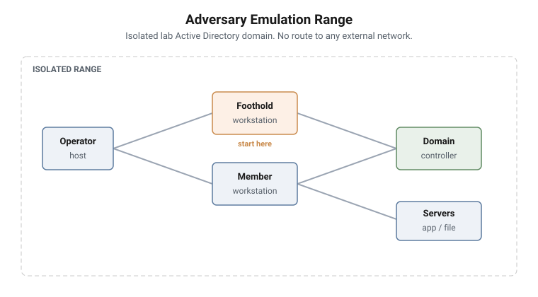

# Adversary Emulation Range

Three campaigns over three days against an isolated lab Active Directory
domain. The student works as an operator on an authorised engagement, and every
technique is framed as emulation carried out to improve the defender.

<picture>
  <source media="(prefers-color-scheme: dark)" srcset="../../diagrams/adversary-emulation-topology-dark.svg">
  
</picture>

## The arc

The three days follow the natural shape of an authorised engagement, and the
ordering is pedagogical rather than arbitrary.

**Day 1 is about knowing the ground.** You cannot move through an environment
you have not mapped, so the range opens with host and domain profiling. The
student finishes the day holding a picture of the domain and the routes across
it, which is the input the next day consumes.

**Day 2 is about moving through it.** Working from the paths Day 1 discovered,
the student reuses token context, moves between hosts, escalates where the
environment permits it, and establishes persistence under controlled
conditions.

**Day 3 is about doing so quietly.** Having established access, the student now
has to keep it against a defender who is watching: script-block and
transcription logging, in-memory inspection, and a C2 channel that has to
survive contact.

Each day is playable on its own, but the sequence is the point. Day 2 assumes
the map Day 1 produced; Day 3 assumes the access Day 2 established.

## The environment

An isolated Active Directory domain with a domain controller, member
workstations and file and application servers. The student starts from an
authorised low-privilege foothold on a member workstation, with no
administrative rights and no prior knowledge of the domain.

The range has no route to anything outside itself. Every host, account, domain
and organisation in it is invented.

## Framing

This is an active defense course. The vocabulary is operator, lab host,
emulation and post-access operations rather than attacker and victim, because
the language shapes how the work is understood and governed. Where a tool's own
documentation uses different terms, the tool's terms are used while teaching it
and the surrounding narrative keeps the engagement framing.

## Campaigns

| Day | Campaign | Missions |
|---|---|---|
| 1 | [AD Enumeration & Path Discovery](01-ad-enumeration.md) | 19 |
| 2 | [Movement, Privilege Escalation, Persistence](02-movement-privesc-persistence.md) | 26 |
| 3 | [Stealth, Payload Handling, C2](03-stealth-payload-c2.md) | 22 |
| | **Total** | **67** |
