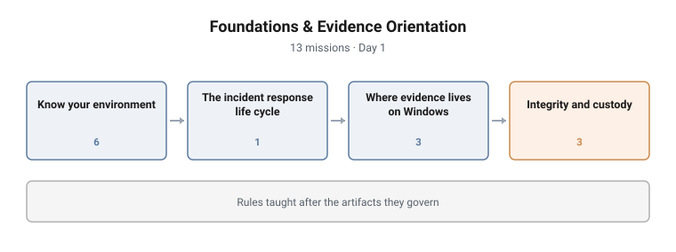

# Foundations & Evidence Orientation

**Range:** DFIR and detection · **Day:** 1 · **Missions:** 13
**Stream:** Blue / defensive operations

<picture>
  <source media="(prefers-color-scheme: dark)" srcset="../../diagrams/dfir-01-foundations-dark.svg">
  
</picture>

## Scenario

The student's first contact with the estate. Before any incident, before any
pressure: learn the ground, learn what evidence is, and learn the rules that
govern handling it.

## Objectives

- Define the scope of digital forensics and incident response
- Establish orientation on an unfamiliar Windows host
- Place a response activity correctly within a recognised incident response life
  cycle
- Locate the principal sources of evidence on a Windows system
- Explain chain of custody and the role of integrity hashing
- Apply the ACPO principles to a handling decision

## Technical scope

**Environment**

A workstation on the Meridian Logistics estate, entered with the access an
analyst would hold. No incident is running.

**What the student works with**

Live host state (logged-on account, hostname, addressing, OS build, local
account inventory), the Windows evidence surfaces (Security event log, prefetch,
per-user registry hives), and an evidence file to hash and record.

**Operations required**

- Establish host identity and context from the host itself
- Enumerate local accounts and interpret the result
- Locate the filesystem and registry paths where Windows records activity
- Compute and record an integrity hash over an evidence file
- Complete the fields a custody record requires

**Tooling**

Native Windows command-line and PowerShell tooling, and a hashing utility.

**Assumed knowledge**

Basic Windows familiarity. This is the entry campaign of the programme and
assumes no prior DFIR exposure.

## Structure and progression

| Block | Focus | Missions |
|---|---|---|
| Know your environment | Orientation on the host and the estate | 6 |
| The incident response life cycle | Ordering the phases | 1 |
| Where evidence lives on Windows | Event logs, prefetch, registry hives | 3 |
| Integrity and custody | Hashing, custody records, ACPO | 3 |

The campaign is ordered from the mundane to the consequential.

It opens with orientation because a responder who cannot describe the machine
they are on cannot describe what changed on it. These are easy missions by
design: they build the habit of establishing context first, and they let a
student who has never touched a range succeed in the first ten minutes.

It then places that activity inside the life cycle, giving the student a frame
for everything the rest of the week will do.

Only then does it introduce evidence sources, and only after that the rules for
handling them.

## What makes this hard

Little, deliberately, and that is the design. The intended difficulty is
**precision rather than complexity**: reading a build number correctly, counting
accounts accurately, recording a hash without transcription error. Students who
treat the easy missions casually carry that habit into Day 2, where it costs
them.

The one genuinely demanding mission is the ACPO principle, which requires
applying a rule to a situation rather than reciting it.

## Design notes

**The easy missions are load-bearing.** Six orientation questions look trivial
next to a chain-of-custody problem. They exist to establish a routine the later
campaigns depend on.

**Rules are taught after the artifacts they govern.** Custody is introduced once
the student has located a registry hive, not before. Teaching the rule first
produces a memorised definition; teaching it second produces an understanding of
why the rule exists.

**Hashing is taught as a custody mechanism, not a command.** One mission asks for
a hash; the mission beside it asks what chain of custody is for. Separating them
stops the technique being learned without the reason.

**Standards are named, not paraphrased.** ACPO and the NIST life cycle are cited
directly so a student can carry the vocabulary into a real team.

## Why this matters operationally

**Orientation failure is the most common first-response error.** Responders who
begin collecting before establishing context produce evidence they cannot later
contextualise, and findings they cannot defend.

**Evidence handling determines whether findings survive.** An investigation that
reaches the right conclusion by a route that breaks admissibility has produced
an opinion, not evidence. In regulated sectors that distinction decides whether
the work was worth doing.

**These artifact locations do not change.** Event logs, prefetch and per-user
registry hives have been the backbone of Windows forensics for two decades and
remain so. Knowing where they are is durable knowledge in a field where tooling
turns over constantly.

## Framework alignment

| Standard | Where it is used |
|---|---|
| **NIST SP 800-61** Computer Security Incident Handling Guide | The incident response life cycle and the ordering of its phases |
| **ISO/IEC 27037** | Identification, collection, acquisition and preservation of digital evidence |
| **ACPO** Good Practice Guide for Digital Evidence | The handling principles applied to a live decision |
| **MITRE D3FEND** | Evidence sources framed as defensive observation surfaces |
| **NICE / DCWF 511** Cyber Defense Analyst | The work role the programme builds toward |

---

> **Confidentiality.** These cyber ranges were designed and built for private
> clients. This page documents design and architecture only. Scenario content,
> mission structure, answer keys and walkthroughs remain confidential, and are
> neither published here nor available on request.
