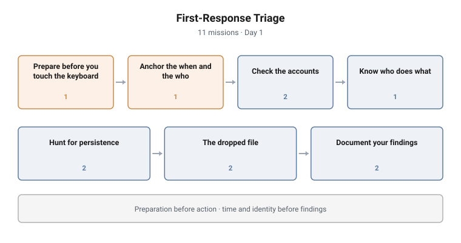

# First-Response Triage

**Range:** DFIR and detection · **Day:** 1 · **Missions:** 11
**Stream:** Blue / defensive operations

<picture>
  <source media="(prefers-color-scheme: dark)" srcset="../../diagrams/dfir-02-first-response-dark.svg">
  
</picture>

## Scenario

A host is behaving oddly and the student is first on the scene. The machine is
running, the clock is ticking, and some actions foreclose others. This is where
orientation stops being an exercise.

## Objectives

- Describe forensic readiness and what belongs in a jump kit
- Anchor an investigation to the host's own time and user context
- Enumerate accounts and identify an anomalous one
- Locate persistence in the two places it is most often found
- Recover and integrity-hash a dropped file
- Record findings to a standard that survives handover

## Technical scope

**Environment**

A live, running host on the estate showing anomalous behaviour. The student has
interactive access and must work without taking it offline.

**What the student works with**

Host time configuration, local account and administrator group membership,
registry autorun locations, the task scheduler, the filesystem, and a custody
record to complete.

**Operations required**

- Establish the host's timezone and reconcile it against recorded timestamps
- Enumerate local administrators and identify an account that does not belong
- Inspect registry autorun locations for an anomalous value
- Enumerate scheduled tasks and identify one that is not legitimate
- Locate a dropped file on disk and compute its integrity hash
- Record the host clock and logged-on user as investigative context

**Tooling**

Native Windows tooling and PowerShell, a hashing utility, and a custody form.

**Assumed knowledge**

Foundations campaign completed: host orientation, evidence locations, and the
custody vocabulary.

## Structure and progression

| Block | Focus | Missions |
|---|---|---|
| Prepare before you touch the keyboard | Forensic readiness, jump kit | 1 |
| Anchor the when and the who | Host timezone | 1 |
| Check the accounts | Local administrators, the anomalous account | 2 |
| Know who does what | IR team roles | 1 |
| Hunt for persistence | Run key, scheduled task | 2 |
| The dropped file | Location and integrity hash | 2 |
| Document your findings | Recording context, custody fields | 2 |

The ordering is a first responder's ordering, and the first two blocks are the
lesson.

**Preparation comes before action.** The campaign opens on readiness before the
student is allowed to touch anything, because the most common first-response
failure is acting before establishing what you are able to act with.

**Time and identity come before findings.** Anchoring the timezone is a single
mission and it governs every timestamp reported for the rest of the week.

Only then does it move to accounts, persistence and the artifact itself, and it
closes on documentation, because a finding nobody can hand over is not a
finding.

## What makes this hard

**The clock.** Every action on a running host changes it. The student has to
decide what to collect first while knowing that collecting at all is destructive.

**An anomalous account looks legitimate.** The rogue administrator is not
obviously wrong. Identifying it requires comparing against what the estate's
normal account structure looks like, which is why the Foundations campaign
established that baseline.

**Two persistence mechanisms found by different methods.** A student who checks
only autoruns, or only scheduled tasks, finds half of what is there and reports
a partial picture confidently.

## Design notes

**Timezone is a mission, not a footnote.** It is a single low-mark question
placed early, and the one most likely to be skipped by a student in a hurry.
Making it graded forces the habit, because getting it wrong turns a correct
finding into a wrong one.

**Two persistence mechanisms, not one.** A student who only ever checks one
develops the exact blind spot an intruder relies on.

**Documentation is graded.** The final two missions ask why context is recorded
and what belongs in a custody field. Investigative technique that cannot survive
handover has limited value.

## Why this matters operationally

**First response is where evidence is most often lost.** Not by adversaries, by
responders. The order of the first ten minutes determines what remains
recoverable.

**Registry autoruns and scheduled tasks remain the commodity persistence
mechanisms.** They are used constantly because they are native, reliable and
frequently unmonitored.

**Timestamp errors survive into legal proceedings.** A misreported time is not a
minor defect; it is a defect that undermines the credibility of every other
finding in the same report.

## Framework alignment

| Standard | Where it is used |
|---|---|
| **NIST SP 800-61** | First response sits inside the Detection and Analysis phase |
| **ISO/IEC 27037** | Preservation constraints when working on a running system |
| **ACPO** | Principle-driven decisions about acting on live evidence |
| **MITRE ATT&CK** | The persistence hunted is T1547.001 Registry Run Keys and T1053.005 Scheduled Task |
| **MITRE D3FEND** | Enumeration and file analysis as named defensive techniques |
| **NICE / DCWF 511** | Cyber Defense Analyst |

---

> **Confidentiality.** These cyber ranges were designed and built for private
> clients. This page documents design and architecture only. Scenario content,
> mission structure, answer keys and walkthroughs remain confidential, and are
> neither published here nor available on request.
