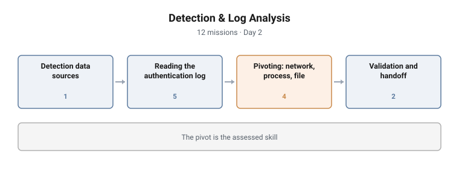

# Detection & Log Analysis

**Range:** DFIR and detection · **Day:** 2 · **Missions:** 12
**Stream:** Blue / defensive operations

<picture>
  <source media="(prefers-color-scheme: dark)" srcset="../../diagrams/dfir-03-detection-log-analysis-dark.svg">
  
</picture>

## Scenario

An alert has fired. The student's job is to decide whether it is real, and if it
is, how far it reaches. This is the campaign that turns a single detection into a
scoped incident.

## Objectives

- Identify the data sources detection is built on
- Read an authentication log and reconstruct an access attempt
- Distinguish a precursor from an indicator
- Pivot from authentication evidence to network and process evidence
- Classify indicator types
- Validate an alert and produce the output the next phase requires

## Technical scope

**Environment**

The Meridian estate with its security tooling and log sources available to the
analyst. The student works from the analyst segment rather than on the affected
host.

**What the student works with**

Authentication logs, network and DNS resolution telemetry, process execution
records, and file artifacts. Each is a separate source and the campaign requires
moving between them.

**Operations required**

- Enumerate and characterise the data sources available for detection
- Read an authentication log to establish source, failure volume, target account
  and first success
- Separate a precursor from an indicator within the same log
- Pivot an indicator into network telemetry and identify a command-and-control
  destination
- Classify indicators by type
- Pivot again into process evidence and identify anomalous execution
- Hash a recovered file and reconcile it against the process evidence
- State an alert validation verdict and produce the phase's output

**Tooling**

The estate's log search and alert tooling, plus native host utilities for file
and process inspection.

**Assumed knowledge**

Day 1 completed: host orientation, evidence locations, custody discipline, and
first-response technique.

## Structure and progression

| Block | Focus | Missions |
|---|---|---|
| From detection to a scoped incident | Detection data sources | 1 |
| Reading the authentication log | Source, failure count, account, timing, precursor vs indicator | 5 |
| Pivoting | C2 domain, indicator types, process, file integrity | 4 |
| Validation and handoff | Alert validation, phase output | 2 |

The campaign is a single investigation told in the order it would actually
happen.

**The authentication block is deliberately the largest.** The student
establishes where the access came from, how many times it failed before it
succeeded, which account fell, and when. That sequence, source then volume then
target then timing, is the shape of nearly every credential-based intrusion, and
practising it as a sequence is the point.

**The pivot block moves off the authentication log entirely**, because an
investigation that stays in one data source finds only what that source records.
Network, then process, then the file itself.

The campaign closes on validation and handoff rather than on the finding,
mirroring the life cycle taught on Day 1.

## What makes this hard

**The pivot is the assessed skill.** Any student can be walked through one log.
Carrying an indicator across a source boundary, and knowing which attribute
survives that crossing, is what separates an analyst from a log reader. It is
also where real investigations stall.

**Precursor and indicator look identical in isolation.** The distinction depends
on what happened afterwards, so the student has to hold a timeline rather than
read a line.

**Volume obscures the first success.** Finding the successful logon among the
failures requires reading the sequence, not searching for a result.

## Design notes

**Precursor versus indicator sits inside the log block, not before it.** The
distinction is abstract when taught from a definition and obvious when the
student has just read both in the same log.

**Integrity hashing recurs.** It appeared on Day 1 and will appear again on
Day 4. Deliberate repetition across campaigns makes it routine rather than a
thing that was mentioned once.

**The campaign ends on an output, not a conclusion.** The final mission asks what
the Detection and Analysis phase must hand to the next phase, which enforces the
life-cycle framing rather than leaving it as theory.

## Why this matters operationally

**The authentication log is where most intrusions first become visible.**
Credential-based access is the dominant initial vector, and the log is the
earliest place it is recorded.

**Single-source investigations under-scope incidents.** The most expensive
incident response errors are scoping errors, and they come from concluding
before pivoting.

**Indicator classification drives what you can do next.** An IP, a domain, a hash
and a behaviour have different lifespans and different detection value. Treating
them interchangeably produces detections that expire immediately.

## Framework alignment

| Standard | Where it is used |
|---|---|
| **NIST SP 800-61** | Precursor and indicator used in their SP 800-61 senses; Detection and Analysis phase output |
| **MITRE ATT&CK** | The activity investigated spans Credential Access, Command and Control and Execution |
| **MITRE D3FEND** | Alert validation, network traffic analysis and process analysis |
| **NICE / DCWF 511** Cyber Defense Analyst | The work role this campaign assesses against |

---

> **Confidentiality.** These cyber ranges were designed and built for private
> clients. This page documents design and architecture only. Scenario content,
> mission structure, answer keys and walkthroughs remain confidential, and are
> neither published here nor available on request.
