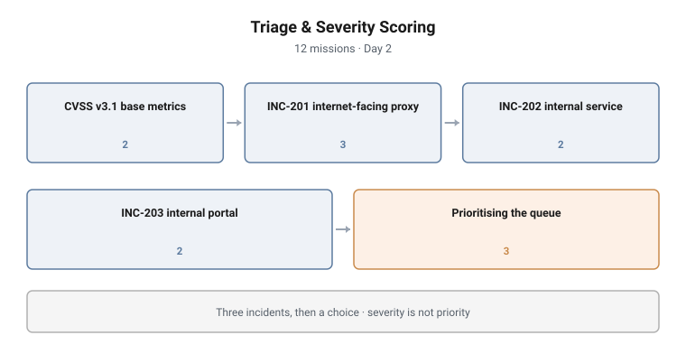

# Triage & Severity Scoring

**Range:** DFIR and detection · **Day:** 2 · **Missions:** 12
**Stream:** Blue / defensive operations

<picture>
  <source media="(prefers-color-scheme: dark)" srcset="../../diagrams/dfir-04-triage-severity-dark.svg">
  
</picture>

## Scenario

Three incidents are open at once and the student cannot work all of them. An
internet-facing reverse proxy, an internal warehouse inventory service, and an
employee self-service portal. Score them, rank them, and defend the ranking.

## Objectives

- Read and interpret CVSS v3.1 base metrics
- Calculate base scores and derive severity ratings
- Construct a CVSS vector string
- Prioritise a queue of concurrent incidents
- Distinguish severity from priority
- Place a triage decision within the OODA loop

## Technical scope

**Environment**

Three concurrent incidents on the Meridian estate, differing deliberately on
exposure and business function:

| Incident | System | Character |
|---|---|---|
| INC-201 | EDGE-RPX-01 | Internet-facing reverse proxy / WAF |
| INC-202 | WH-INV-SVC | Internal warehouse inventory service |
| INC-203 | HR-PORTAL | Internal employee self-service portal |

**What the student works with**

Incident descriptions sufficient to derive CVSS base metrics, and the estate
context needed to judge business impact.

**Operations required**

- Read an incident description and derive each CVSS base metric from it
- Compute a base score and map it to a severity rating
- Construct a well-formed CVSS vector string
- Rank three scored incidents into a work queue
- Articulate why the ranking is not simply the score order
- Situate the decision within a recognised decision loop

**Tooling**

The CVSS v3.1 specification and calculator.

**Assumed knowledge**

Detection and analysis technique from the preceding campaign, and enough estate
familiarity to reason about business function.

## Structure and progression

| Block | Focus | Missions |
|---|---|---|
| CVSS v3.1 base metrics | Reading User Interaction and Attack Complexity | 2 |
| INC-201 | Base score, severity, vector string | 3 |
| INC-202 | Base score, severity | 2 |
| INC-203 | Base score, severity | 2 |
| Prioritising the queue | Ranking, severity vs priority, OODA | 3 |

Two metric-reading missions come first, so the student scores from understanding
rather than from a calculator.

Three incidents are then scored in sequence. They differ on the axes that
matter, so the internet-facing proxy and the internal portal will not score the
same and the student should be able to say why before computing anything.

**The final block is where the campaign earns its place.** Having produced three
scores, the student ranks the queue and then answers why severity and priority
are not the same thing.

## What makes this hard

**The ranking is not the score order, and the student must prove it.** A
lower-scoring incident on a business-critical system can outrank a higher-scoring
one. Stating that is easy; defending a specific ranking against a specific score
set is not.

**CVSS metrics are judgement calls dressed as categories.** Attack Complexity and
User Interaction in particular require reading an incident description carefully
and resisting the assumption that the worst case applies.

**Three at once is the real constraint.** Scoring one incident is an exercise.
Scoring three and then choosing is triage.

## Design notes

**Three incidents, not one.** A single scoring exercise teaches the tool. Three,
scored in a row and then ranked, teaches judgement. The ranking mission is the
one that matters.

**Severity versus priority is the campaign's thesis.** CVSS produces a number;
triage produces a decision. Treating the number as the decision is the most
common failure in junior triage and it is assessed explicitly.

**The incidents were chosen to disagree.** Exposure, business function and user
interaction pull in different directions across the three, so no single heuristic
produces the right queue.

**OODA anchors the decision.** The closing mission places triage inside a
decision framework, so the student leaves with a model rather than a procedure.

## Why this matters operationally

**Real SOCs have more alerts than analysts.** Triage is a capacity problem before
it is a knowledge problem, and training that scores incidents without ever
forcing a choice omits the actual job.

**CVSS is widely used and widely misused.** It scores technical severity of a
vulnerability, not organisational risk of an incident. Teams that treat the base
score as a work-ordering instruction systematically mis-prioritise.

**Business context is not available in the telemetry.** Knowing that the
warehouse service runs the loading bay, and the portal does not, is what turns a
score into a decision. Analysts who never learn the estate cannot triage it.

## Framework alignment

| Standard | Where it is used |
|---|---|
| **CVSS v3.1** | Base metrics, base score, severity rating, vector string construction |
| **NIST SP 800-61** | Prioritisation as a named life-cycle activity |
| **OODA** | The decision frame the closing mission places triage inside |
| **NICE / DCWF 511 to 531** | The campaign sits on the boundary between Cyber Defense Analyst and Cyber Defense Incident Responder |

---

> **Confidentiality.** These cyber ranges were designed and built for private
> clients. This page documents design and architecture only. Scenario content,
> mission structure, answer keys and walkthroughs remain confidential, and are
> neither published here nor available on request.
