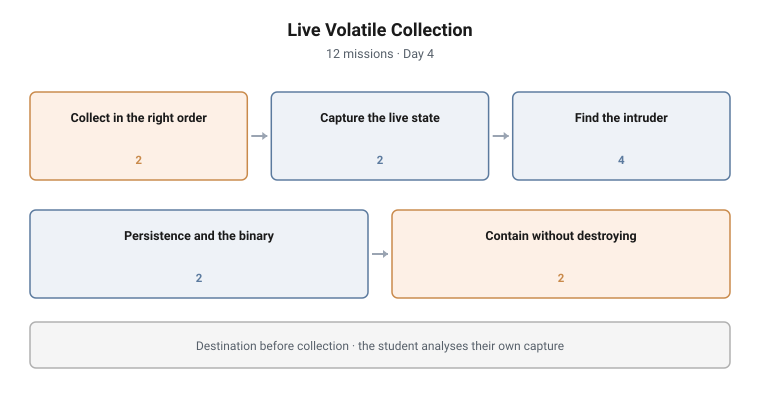

# Live Volatile Collection

**Range:** DFIR and detection · **Day:** 4 · **Missions:** 12
**Stream:** Blue / defensive operations

<picture>
  <source media="(prefers-color-scheme: dark)" srcset="../../diagrams/dfir-05-live-volatile-dark.svg">
  
</picture>

## Scenario

A host is live, compromised, and cannot simply be pulled. Evidence is
disappearing as the student watches, and the act of collecting changes what is
there. Collect it in the right order, to the right place, and find the intruder
in what you captured.

## Objectives

- Apply order of volatility to a live collection
- Select a defensible output destination for collected evidence
- Capture live system state and integrity-hash the outputs
- Identify a beacon process, its image path and its command-and-control endpoint
- Locate the persistence mechanism and hash the binary
- Choose a containment action that preserves evidence
- Identify the modern replacement for a deprecated collection tool

## Technical scope

**Environment**

A running, compromised host on the estate carrying an active beacon, its
persistence mechanism, and the binary behind both. The host must remain running
throughout.

**What the student works with**

Volatile system state (running processes and their image paths, active network
connections, logged-on sessions), registry autorun locations, the filesystem, and
their own collection outputs.

**Operations required**

- Order a set of evidence types by volatility and justify the sequence
- Choose an output destination that does not overwrite the evidence being sought
- Execute a live collection set against the running host
- Compute integrity hashes across the collection outputs
- Analyse their own capture to identify an anomalous process and its image path
- Extract the command-and-control endpoint and port from captured connection state
- Locate the persistence entry and hash the binary it references
- Select a containment action and justify it against its evidence cost

**Tooling**

A native live-collection utility the student will still meet on older estates,
its modern replacement, and a hashing utility.

**Assumed knowledge**

Days 1 and 2 completed: evidence handling, custody, persistence locations,
detection and pivoting technique.

## Structure and progression

| Block | Focus | Missions |
|---|---|---|
| Collect in the right order | Order of volatility, output destination | 2 |
| Capture the live state | Running the collection set, hashing outputs | 2 |
| Find the intruder | Beacon process, image path, C2 address, C2 port | 4 |
| Persistence and the binary | Run key, binary hash | 2 |
| Contain without destroying | Evidence-preserving containment, tooling succession | 2 |

The campaign inverts the usual teaching order deliberately. It does not start
with "find the malware." It starts with **where the output goes**, because a
collection written to the compromised disk overwrites the unallocated space that
may hold the evidence.

Order of volatility then governs the capture. Only once the student has captured
correctly do they analyse what they captured, which means the analysis is
performed on their own evidence rather than on something handed to them.

The closing block is the hardest judgement in the campaign: containment that does
not destroy evidence.

## What makes this hard

**The collection is destructive and unavoidable.** Every command run on the host
changes it. The student has to accept that and sequence accordingly rather than
trying to avoid it.

**The analysis is only as good as the capture.** A student who collects
carelessly cannot recover later, because the state they needed is gone. The
campaign makes that consequence real rather than describing it.

**Containment has no free option.** Pulling the network cable, killing the
process and shutting the host down each stop the bleeding and each cost
something irreplaceable. The mission has a defensible answer rather than an
obvious one, and the reasoning is the assessed content.

## Design notes

**Destination before collection.** The second mission of the campaign is where to
write output. It is placed before any collection because getting it wrong
invalidates everything after it, and students reliably get it wrong when they
meet it later.

**The student analyses their own capture.** Handing over a prepared memory dump
teaches analysis. Making them produce the capture first teaches that the quality
of an analysis is bounded by the quality of the collection.

**Containment is a trade-off, not a procedure.** Teaching it as a checklist
produces responders who pull cables reflexively. Teaching it as a costed decision
produces responders who can justify the choice afterwards.

**Deprecated tooling is taught with its successor.** The collection uses a tool
the student will meet on older estates, and a mission asks what replaced it.
Teaching only the modern tool leaves a responder stuck in front of a 2012 server.

## Why this matters operationally

**Volatile evidence is lost by the responder more often than by the adversary.**
Order of volatility exists because the wrong first action destroys the thing you
came for.

**Memory-resident tradecraft made live collection mandatory.** An adversary who
never writes a payload to disk leaves evidence only in volatile state. A
responder who images the disk and reboots has collected everything except the
intrusion.

**Containment decisions are made under pressure by the most junior person
present.** Rehearsing the trade-off in a lab is the only realistic preparation
for making it correctly at three in the morning.

**Estates run old tooling for a long time.** Deprecated utilities remain the only
option on legacy hosts, which are also the hosts most likely to be compromised.

## Framework alignment

| Standard | Where it is used |
|---|---|
| **RFC 3227** Guidelines for Evidence Collection and Archiving | Order of volatility governs the capture sequence |
| **ISO/IEC 27037** | Acquisition and preservation of volatile evidence |
| **NIST SP 800-61** | Containment as a life-cycle phase with an evidence cost |
| **MITRE ATT&CK** | The intruder activity located spans Persistence (T1547.001) and Command and Control (T1071) |
| **MITRE D3FEND** | Process analysis, network traffic analysis and file analysis |
| **NICE / DCWF 531** Cyber Defense Incident Responder | The work role this campaign assesses against |

---

> **Confidentiality.** These cyber ranges were designed and built for private
> clients. This page documents design and architecture only. Scenario content,
> mission structure, answer keys and walkthroughs remain confidential, and are
> neither published here nor available on request.
