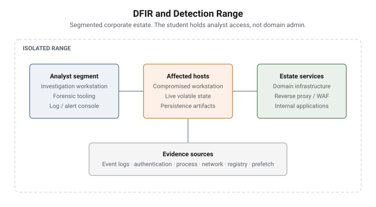

# DFIR and Detection Range

Five range campaigns inside a five-day DFIR programme, sharing one continuity
scenario so the student works a single organisation across the week rather than
five disconnected exercises.

The campaigns cover days 1, 2 and 4. The remaining practical sessions use other
formats - a tabletop exercise and an instructor-led capstone - which are not
documented here.

## The scenario

Meridian Logistics, a fictional freight and distribution company. The student
joins as a member of its incident response capability. The company, its estate,
its staff and its incident exist only in the range.

Continuity does real pedagogical work here. By Day 4 the student already knows
the estate, so the cognitive load moves off orientation and onto the technique
being taught. It also lets an artifact introduced early be recontextualised
later, which is how real investigations actually feel.

<picture>
  <source media="(prefers-color-scheme: dark)" srcset="../../diagrams/dfir-range-topology-dark.svg">
  
</picture>

## The arc

**Foundations & Evidence Orientation** establishes the discipline before the
pressure arrives: what evidence is, how it is handled, what breaks
admissibility, and what the estate looks like.

**First-Response Triage** puts the student into a live incident with the
constraints first responders actually face - incomplete information, a running
system, and decisions that foreclose options if taken in the wrong order.

**Detection & Log Analysis** moves from response to detection: validating
alerts, separating true positives from false, and scoping indicators across
the estate.

**Triage & Severity Scoring** adds the part most training omits - there is more
work than time. The student prioritises a queue, scores severity, and absorbs a
threat-intelligence inject partway through that merges two apparently separate
alerts into one campaign.

**Live Volatile Collection** returns to the host to collect volatile evidence
in order of volatility, where the act of collecting changes what is there.

## The environment

A segmented corporate estate: domain infrastructure, user workstations,
servers, and the security tooling an analyst works through. Students are given
the access an analyst would hold, not administrative access to everything.

## Campaigns

| Day | Campaign | Missions |
|---|---|---|
| 1 | [Foundations & Evidence Orientation](01-foundations-evidence-orientation.md) | 13 |
| 1 | [First-Response Triage](02-first-response-triage.md) | 11 |
| 2 | [Detection & Log Analysis](03-detection-log-analysis.md) | 12 |
| 2 | [Triage & Severity Scoring](04-triage-severity-scoring.md) | 12 |
| 4 | [Live Volatile Collection](05-live-volatile-collection.md) | 12 |
| | **Total** | **60** |
