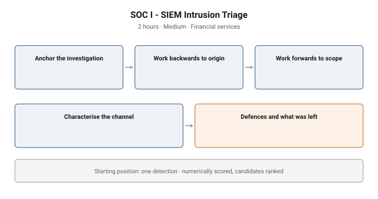

# SOC I - SIEM Intrusion Triage

**Tier:** I · **Work role:** DCWF 511 Cyber Defense Analyst · **Stream:** Blue
**Format:** Challenge (gated) · **Duration:** 2 hours · **Difficulty:** Medium
**Sector:** Financial services

<picture>
  <source media="(prefers-color-scheme: dark)" srcset="../../diagrams/soc-01-siem-triage-dark.svg">
  
</picture>

## Scenario

A financial-sector SOC receives a single high-confidence detection on one
endpoint. There is no scope, no timeline, and no list of affected hosts.

The candidate must work that detection **backwards to patient zero** and
**forwards to full scope**, using the SIEM and the affected endpoint. Findings
are scored numerically so candidates can be ranked rather than marked pass or
fail.

No course precedes this. It is a measurement instrument, not a lab exercise, and
it assumes the capability rather than teaching it.

## Objectives

What the assessment measures. The candidate must be able to:

- Validate an alert and anchor an investigation from a single detection
- Reconstruct an execution chain across process, script and network telemetry
- Identify command-and-control infrastructure and characterise the channel from
  its behaviour
- Detect tampering with defensive controls
- Identify persistence and distinguish it from routine autostart activity
- Establish the full scope of the intrusion, not only its entry point

## Technical scope

**Data surface**

| Source | What it carries |
|---|---|
| Windows Security event log | Authentication, account and privilege events |
| Sysmon | Process creation and lineage, network connections, image loads, registry activity |
| PowerShell operational and script-block logs | Script execution and its content |
| Network and proxy telemetry | Outbound connections and destination characteristics |
| The affected endpoint | Live host access alongside the SIEM |

**Operations required**

- Construct and refine Splunk SPL searches across multiple sourcetypes, and pivot
  between them carrying an indicator
- Read process lineage to reconstruct an execution chain from a child process
  back to its origin
- Correlate process, script and network telemetry into a single ordered narrative
- Characterise a command-and-control channel from network behaviour rather than
  from a signature
- Detect defensive-control tampering, which is a different search problem from
  detecting malicious execution
- Separate persistence from legitimate autostart configuration

**Tooling**

Splunk and the affected endpoint's native tooling.

**Assumed knowledge**

Splunk SPL, Windows security event and Sysmon event types, the ATT&CK tactic
model, and common intrusion tradecraft.

## Structure and progression

The assessment follows the shape of the investigation rather than a syllabus.

1. **Anchor** the investigation on the detection and establish what is actually
   true about it
2. **Work backwards** through process lineage to the origin of execution
3. **Work forwards** to establish the scope the detection did not report
4. **Characterise the channel** the intrusion used to reach outside the estate
5. **Establish what was done to the defences**, and what was left behind to
   survive

Mission structure, weighting and band composition are deliberately not published.

## What makes this hard

**Discipline under an incomplete picture.** The candidate has one true fact and
must not over-read it. A common failure is anchoring the whole investigation on
the first host and never establishing whether it was the first host.

**Direction.** Backwards to origin and forwards to scope are different search
strategies. Candidates who run only one finish with either an unexplained alert
or an unbounded incident.

**Tampering is quiet.** Defensive-control modification does not look like
execution and is not found by searching for malicious activity. It requires
knowing what the controls should look like.

## Design notes

**One detection, deliberately.** Giving the candidate a scoped incident would
measure analysis while skipping the part that fails in practice. Scoping is the
assessment.

**Numerically scored, not pass/fail.** The instrument exists to rank candidates
for a tier, so partial credit and discrimination between mid-range performers
matter more than a threshold.

**The endpoint is available alongside the SIEM.** Restricting the candidate to
the SIEM alone would test search skill rather than investigative skill. Real
analysts have both, and choosing when to leave the SIEM is part of the
competency.

**No teaching precedes it.** The assessment is written against the work role, not
against a course, so it measures capability wherever it was acquired.

## Why this matters operationally

**Tier 1 is where incidents are correctly or incorrectly scoped**, and scoping
errors are the most expensive errors in incident response. An intrusion declared
contained on one host, when it reached four, produces a second incident weeks
later.

**Alert validation is the highest-volume task in a real SOC.** The ability to
reject a false positive quickly, with reasoning, is as valuable as the ability to
confirm a true one.

**Defensive-control tampering is a reliable intrusion indicator** and one that
junior analysts routinely miss, because it is not what the alert was about.

## Framework alignment

| Framework | Alignment |
|---|---|
| **DCWF 511** Cyber Defense Analyst | The work role this tier assesses |
| **NICE** (NIST SP 800-181r1) | Task and skill statements for detection analysis and event correlation |
| **MITRE ATT&CK** | Initial Access, Execution, Persistence, Defense Evasion, Credential Access, Command and Control |
| **MITRE D3FEND** | Network traffic analysis, process analysis, platform monitoring |

---

> **Confidentiality.** These cyber ranges were designed and built for private
> clients. This page documents design and architecture only. Scenario content,
> mission structure, answer keys and walkthroughs remain confidential, and are
> neither published here nor available on request.
