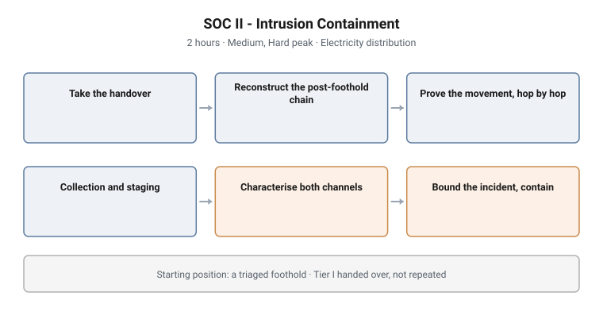

# SOC II - Intrusion Containment

**Tier:** II · **Work role:** DCWF 531 Cyber Defense Incident Responder
**Stream:** Blue team / defensive operations · **Format:** Challenge (gated)
**Duration:** 2 hours · **Difficulty:** Medium, with a Hard peak
**Sector:** Electricity distribution utility

<picture>
  <source media="(prefers-color-scheme: dark)" srcset="../../diagrams/soc-02-containment-dark.svg">
  
</picture>

## Scenario

An electricity distribution utility has a confirmed intrusion. The candidate
picks up **an already-triaged foothold**: Tier I work is handed over, not
repeated.

From that handover they must establish what the adversary did next, how far they
reached, what they staged, and what must be contained.

## Objectives

- Reconstruct a post-foothold intrusion across privilege escalation, credential
  access, discovery, lateral movement and collection
- Prove a two-hop lateral movement chain rather than inferring the second hop
- Characterise two independent command channels
- Derive a beacon cadence statistically from connection timing
- Establish the full blast radius of the intrusion
- Prove where the intrusion stopped, not only where it went
- Determine what must be contained, and in what order

## Technical scope

**Data surface**

Windows Security and Sysmon telemetry across multiple hosts, authentication and
Kerberos events, process lineage, network connection records, and evidence of
staged collection.

**Operations required**

- Reconstruct privilege escalation and establish how it was obtained
- Identify credential access, including Kerberos-based credential theft
- Trace account and group enumeration across the estate
- Prove a two-hop lateral movement chain with evidence at each hop
- Identify what was collected and where it was staged before leaving
- Characterise two independent command channels
- Derive a beacon interval from a connection-timing distribution, which cannot be
  answered by search alone
- Bound the intrusion and evidence the boundary

**Tooling**

The estate SIEM with search across sourcetypes, and whatever analysis the
candidate chooses to apply to timing data.

**Assumed knowledge**

Tier I capability: SIEM search fluency, Windows event and Sysmon familiarity, and
the ability to read process lineage. Triage and initial scoping are assumed, not
assessed.

## Structure and progression

1. **Take the handover** and establish what is already known and how reliably
2. **Reconstruct the post-foothold chain**: escalation, credential access,
   discovery
3. **Prove the movement**, hop by hop, rather than inferring reach
4. **Identify collection and staging**: what was gathered and where it was put
5. **Characterise both command channels**, including the statistically derived
   cadence
6. **Bound the incident** and determine the containment set

Mission structure, weighting and band composition are deliberately not published.

## What makes this hard

**Proving a negative.** Establishing where an intrusion stopped is harder than
tracing where it went, and it is the claim a containment decision actually rests
on. A responder who cannot bound the incident cannot scope the containment.

**Two channels, not one.** Finding the obvious channel and stopping is the
designed failure mode. Real intrusions carry fallback access, and containment
that removes only the primary channel is containment that fails.

**Statistical rather than lexical analysis.** The beacon cadence cannot be
searched for. It must be derived from an interval distribution, which separates
candidates who query from candidates who analyse. This is the Hard peak of the
assessment.

**The second hop must be proven.** Inferring that movement continued is not the
same as evidencing it, and the distinction determines whether the containment set
is correct.

## Design notes

**Tier I is handed over, not repeated.** The boundary between the tiers is
deliberate and explicit: this assessment does not re-test triage. Re-testing it
would waste the clock and blur what the tier measures.

**Two channels exist because real intrusions have them.** The second channel is
not a trick. It reflects the operational reality that adversaries build
redundancy, and that incomplete containment is the most common containment
outcome.

**The cadence mission is deliberately unsearchable.** It exists to distinguish
analysis from retrieval at a tier where that distinction becomes the job.

**Containment is the deliverable, not the finding.** The assessment terminates in
what must be done, which is what an incident responder is actually accountable
for.

## Why this matters operationally

**Incomplete containment is the standard failure mode.** Incidents recur because
the response removed what was found rather than what was there. The two-channel
design targets exactly this.

**Blast radius determines cost.** Every downstream decision, notification,
regulatory, operational, depends on knowing the reach. Getting it wrong in either
direction is expensive.

**Beaconing analysis is a durable skill.** Signatures expire; periodicity does
not. Deriving cadence from timing works against tooling that has never been seen
before, which is why it is the peak of this tier.

**Critical national infrastructure raises the stakes of the same skills.** The
sector is chosen so the containment trade-offs carry operational consequences a
candidate has to weigh, not just technical ones.

## Framework alignment

| Framework | Alignment |
|---|---|
| **DCWF 531** Cyber Defense Incident Responder | The work role this tier assesses |
| **NICE** (NIST SP 800-181r1) | Task and skill statements for incident response and incident scoping |
| **MITRE ATT&CK** | T1566, T1053, T1543, T1078, T1003, T1558, T1036, T1087, T1069, T1021, T1071, T1573, T1560, T1074 |
| **MITRE D3FEND** | Network traffic analysis, process analysis, credential and account analysis |

The ATT&CK coverage spans Initial Access, Execution, Persistence, Privilege
Escalation, Defense Evasion, Credential Access, Discovery, Lateral Movement,
Collection and Command and Control. Nine tactics inside a two-hour assessment.

---

> **Confidentiality.** These cyber ranges were designed and built for private
> clients. This page documents design and architecture only. Scenario content,
> mission structure, answer keys and walkthroughs remain confidential, and are
> neither published here nor available on request.
