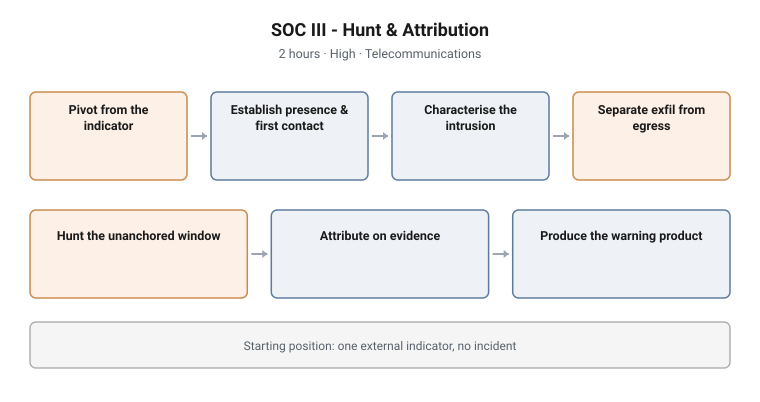

# SOC III - Hunt & Attribution

**Tier:** III · **Work role:** DCWF 141 Threat/Warning Analyst
**Stream:** Blue team / defensive operations · **Format:** Challenge (gated)
**Duration:** 2 hours · **Difficulty:** High
**Sector:** Telecommunications

<picture>
  <source media="(prefers-color-scheme: dark)" srcset="../../diagrams/soc-03-hunt-attribution-dark.svg">
  
</picture>

## Scenario

**One external threat indicator. No incident.**

That is the whole starting position, and it is what separates Tier III from the
tiers below it. Tier I is handed a detection. Tier II is handed a foothold.
Tier III is handed something that may mean nothing at all, and must establish
whether the organisation is compromised before it can investigate anything.

## Objectives

- Establish presence and first contact from a single external indicator
- Characterise a current intrusion across persistence, tooling, credential access
  and a multi-hop chain
- Separate exfiltration from legitimate egress
- Hunt an unanchored four-week window for earlier activity by the same operator
- Link current and historical activity to a common operator on evidence
- Produce a written intelligence product stating a judgement and its confidence

## Technical scope

**Data surface**

Multiple sourcetypes across the estate: process and Sysmon telemetry,
authentication and Kerberos events, script execution, network and proxy records,
and mail and application logs. The window under investigation spans weeks, not
hours.

**Operations required**

- Pivot from one external indicator into internal telemetry and establish whether
  it corresponds to anything at all
- Reconstruct persistence, tooling and credential access for a live intrusion
- Trace a multi-hop chain across the estate
- Characterise an egress channel by behaviour rather than volume: regularity,
  periodicity and consistency against a comparable benign baseline
- Construct, test and discard hunting hypotheses against a four-week window with
  no alert and no timestamp to anchor to
- Correlate two separate episodes to a common operator on technical evidence
- Write an intelligence product for a decision-maker

**Tooling**

The estate SIEM across all sourcetypes, and a reporting template for the
intelligence product.

**Assumed knowledge**

Tier II capability: SIEM search fluency across sourcetypes, Windows security
event and Sysmon familiarity, process-lineage reading, Kerberos and
authentication reasoning, and comfort constructing a hunt without an alert to
start from. Triage and incident scoping are assumed, not assessed.

## Structure and progression

1. **Pivot from the indicator** and establish whether there is anything here
2. **Establish presence and first contact** if there is
3. **Characterise the current intrusion**: persistence, tooling, credential
   access, the chain
4. **Separate exfiltration from legitimate egress**
5. **Hunt the unanchored window** for earlier activity by the same operator
6. **Attribute** on evidence, and state the confidence
7. **Produce the warning product**

Mission structure, weighting and band composition are deliberately not published.

## What makes this hard

**No anchor.** Every technique the lower tiers rely on assumes a starting point.
Removing it changes the nature of the work from investigation to hunting.

**The historical episode has no timestamp.** Earlier activity by the same
operator has to be found across a four-week window without knowing when, where,
or whether it happened. Candidates who cannot construct and abandon hypotheses
stall here.

**Egress hides in legitimate volume.** A busy estate moves large volumes outbound
for entirely legitimate reasons. Distinguishing the intrusion's channel requires
characterising behaviour, not size, and the naive approach of sorting by volume
returns the wrong answer confidently.

**Attribution is a judgement, not a lookup.** The candidate must reason to a
conclusion the evidence supports, state it with a confidence level, and defend
the reasoning. There is no field in the telemetry that contains the answer.

**Two hours.** The time limit is part of the instrument. Tier III work is not
hard because any single step is impossible; it is hard because prioritising
correctly under a clock is the competency being measured.

## Design notes

**The starting position is the design.** Handing the candidate an indicator
rather than an incident is what makes this a hunting assessment. Everything else
follows from that single decision.

**The historical episode exists to test hypothesis discipline.** A candidate who
can only work forwards from a known event cannot do threat and warning work. The
unanchored window is the only way to assess that directly.

**Legitimate egress is generous, deliberately.** The benign baseline is built to
be large and plausible, because an exfiltration channel that stands out by volume
would test nothing.

**The deliverable is a written product, not a set of answers.** A Tier III
analyst who can find the intrusion but cannot communicate it to a decision-maker
has not done the job, so the instrument assesses the communication.

**Attribution is scored on reasoning, not on naming.** The evidence supports a
judgement at a confidence level. Candidates who assert beyond the evidence are
not rewarded for a lucky guess.

## Why this matters operationally

**Threat and warning work begins without an incident.** Most organisations can
respond to an alert. Far fewer can take an external indicator and determine
whether it means anything internally, which is the gap this tier measures.

**Dwell time is measured in weeks.** An operator who has been present before, and
was never detected, is the realistic case rather than the exotic one. Hunting an
unanchored window is what finding them actually requires.

**Exfiltration detection by volume fails against patient adversaries.** Behavioural
characterisation, regularity and periodicity, works where thresholds do not.

**Intelligence products drive decisions that cost money.** A warning that cannot
be acted on, or that overstates confidence, does damage of its own. Assessing the
product alongside the analysis reflects how the role is actually judged.

## Framework alignment

| Framework | Alignment |
|---|---|
| **DCWF 141** Threat/Warning Analyst | The work role this tier assesses |
| **NICE** (NIST SP 800-181r1) | Task and skill statements for threat analysis, hunting and warning |
| **MITRE ATT&CK** | T1071, T1053, T1036, T1105, T1003, T1558, T1021, T1078, T1560, T1074, T1041, T1204, T1547, T1543 |
| **MITRE D3FEND** | Network traffic analysis, file and directory analysis, credential analysis, identifier analysis |

## The difficulty instrument, demonstrated

This tier is the clearest example of why difficulty is measured rather than
asserted. The three figures were kept apart throughout:

| Figure | Value | What it is |
|---|---|---|
| **DESIGN** | 6.91, peak 9 | What the missions were priced at when authored |
| **PREDICTION** | 5.8 | What the design team expected a blind solver to experience |
| **MEASURED** | **5.83, peak 7** | What a gated blind solve actually produced |
| TARGET | 7.0 | Carried deliberate margin; never the scored figure |

The prediction was accurate to **+0.03**, well inside the tolerance the
instrument sets. The design figure was **a full point higher than reality**,
which is the recurring lesson: authors systematically overestimate the difficulty
of content they built and understand.

Only the measured figure describes the shipped assessment, and only it is quoted.

---

> **Confidentiality.** These cyber ranges were designed and built for private
> clients. This page documents design and architecture only. Scenario content,
> mission structure, answer keys and walkthroughs remain confidential, and are
> neither published here nor available on request.
