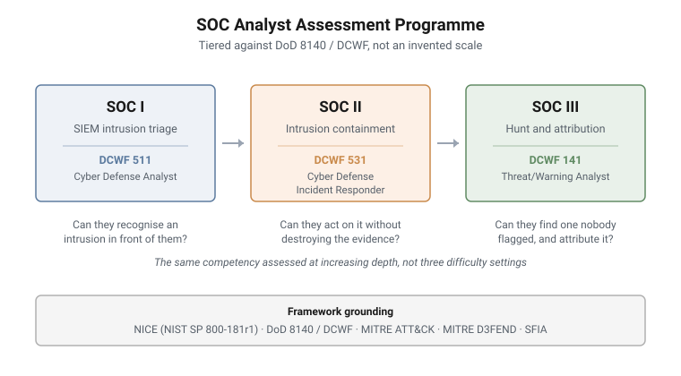

# SOC Analyst Assessment Programme

A three-tier assessment programme that measures whether a SOC analyst can find
an intrusion inside telemetry, built as graded hands-on ranges rather than as a
written exam.

| Tier | Competency focus |
|---|---|
| **SOC I** | SIEM intrusion triage |
| **SOC II** | Intrusion containment |
| **SOC III** | Hunt and attribution |

---

<picture>
  <source media="(prefers-color-scheme: dark)" srcset="../../diagrams/soc-assessment-tiers-dark.svg">
  
</picture>

## Grounded in published workforce standards

The tiering is not invented. It is taken from the doctrinal ladder that already
exists, so a result means something outside the organisation that issued it.

| Framework | What it supplies |
|---|---|
| **DoD 8140 / DCWF** (DoDM 8140.03) | **The primary tiering standard.** Basic / Intermediate / Advanced, with work roles **511 Cyber Defense Analyst**, **531 Cyber Defense Incident Responder** and **141 Threat/Warning Analyst** mapping to tiers I, II and III |
| **NICE Workforce Framework** (NIST SP 800-181r1) | Work roles and the assessable Task, Knowledge and Skill statements each tier is written against |
| **MITRE ATT&CK Enterprise** | The adversary behaviour the telemetry actually contains |
| **MITRE D3FEND** (v1.3.0) | The defensive counterpart: what the analyst is expected to do about it |
| **SFIA** | Responsibility and autonomy levels, for organisations that grade on SFIA |

**Why DCWF rather than NICE for tiering.** NICE describes work roles well but does
not supply a native proficiency ladder. DCWF does, and it is doctrinal rather
than improvised, so the three tiers inherit a defensible definition of what
"more advanced" means instead of asserting one.

## The proficiency gradient

The three tiers are not three difficulty settings on the same exercise. The same
competency is assessed at increasing depth:

- **Tier I** asks whether the analyst can recognise an intrusion in front of them
- **Tier II** asks whether they can act on it without destroying what it is made of
- **Tier III** asks whether they can find one nobody has flagged, and say who it
  was and what they were after

Each tier therefore requires a materially different environment, not a longer
version of the previous one.

---

## What makes the instrument unusual

**Difficulty is measured, not asserted.** Three things that most training
content collapses into a single number are kept apart: what a mission was
**priced** at when authored, what a proposed change was **projected** to buy, and
what a blind solver **actually experienced**. Only the third describes the
shipped product, and only it may be quoted as the difficulty.

**Answers are anchored to the environment.** A graded answer must be derivable
only by doing the work in the range. This is a design constraint applied at
authoring time rather than a hardening pass afterwards, because retro-fitting it
means re-anchoring missions that were already built around the wrong property.

**Assessment integrity is treated as a threat model.** Three routes to an answer
are considered explicitly: obtaining it off-box, reading it on-box, and guessing
it. An answer readable on the host, or reachable in a handful of blind
submissions, is not an assessment question regardless of how hard the intended
path is.

**Nothing ships on the author's word.** Mechanical validation gates plus a blind
solve by someone who did not build it. A check that cannot report how much of the
population it examined is not treated as a check.

---

## Deliberately not documented here

Mission structure, band composition, scenario, estate, actors, difficulty
arithmetic, and anything tier-specific beyond the competency focus named above.

**These are measuring instruments, not teaching labs.** A lab's value survives
being described; an assessment's value is precisely that the candidate does not
know what is coming. The programme architecture and its framework grounding can
be shown without degrading the instrument. The content cannot.
